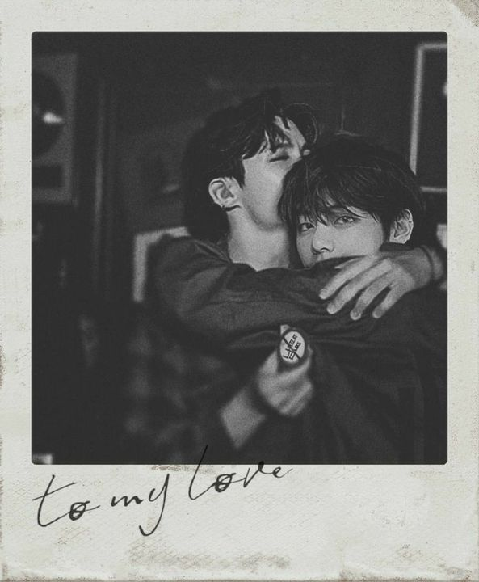
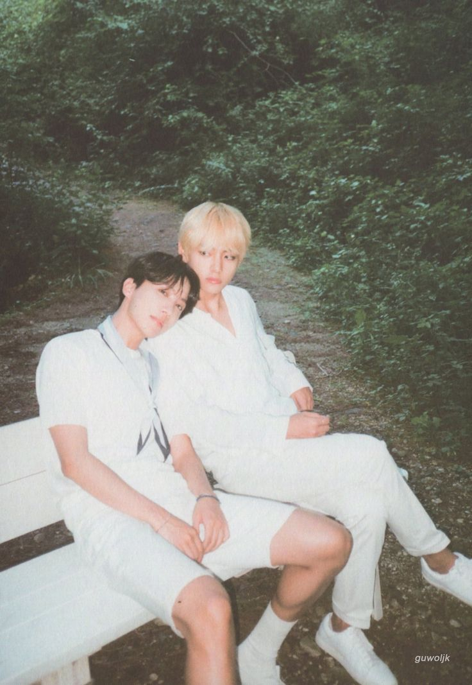
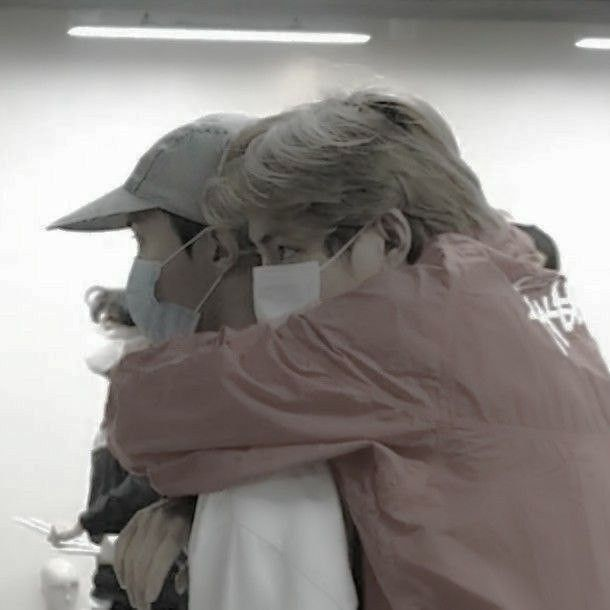

<head>
  <meta charset="UTF-8">
  <meta name="viewport" content="width=device-width, initial-scale=1.0">
  <title >Para meu Solzinho</title>
  <link rel="icon" href="vhope1.jpeg" type="image / icon-x"> 
  
  
  
</head>
<body>
  
  <h1>╭───────────────╮  
│  ✧･ﾟ: ✧･ﾟ:     │  
│   𝒫𝒶𝓇𝒶 𝓂𝑒𝓊        │  
│     ☀𝒮𝑜𝓁𝓏𝒾𝓃𝒽𝑜☀   │  
│  :･ﾟ✧:･ﾟ✧     │  
╰───────────────╯

   (づ｡◕‿‿◕｡)づ   
    ༄♡彡 ☁☀✨
       ⊹˚₊‧────────‧₊˚⊹</h1>
  <h2>Para o meu Hope, com amor
</h2>  

    
Quando o mundo parece barulhento demais, quando a realidade me pesa nos ombros… é em você que eu penso. Você, que com um sorriso, acalma minhas tempestades. Que com uma palavra, transforma meu caos em calma.
      Se eu tivesse uma Magic Shop, você seria a porta que eu escolheria abrir todos os dias.
      Porque você é esse lugar seguro, mesmo distante. Um abrigo de luz quando tudo parece escuro. Você me faz lembrar que tudo bem não estar bem o tempo todo — e que amor, de verdade, não cobra, não julga, só acolhe.
      Às vezes, fecho os olhos e quase posso sentir sua presença. Sua risada me alcançando do outro lado da tela. Seu jeito doce me puxando de volta pra mim mesma, mesmo quando eu esqueço quem sou.
      Você é minha mágica favorita. Feliz vida, meu Sol. Obrigada por ser meu lugar calmo no meio da correria. Eu prometo continuar abrindo essa porta pra você, todos os dias.

    
    
Com amor, Sua Malu/Tete

  
  <audio controls autoplay loop>
    <source src="BTS - 'Magic Shop' (Legendado⧸Tradução).mp3" type="audio/mpeg">
    
  </audio>  

    
    
    
    
    
    
    

  
 em 1 de julho, o céu sorriu,
e o sol brilhou um pouco mais.
nasceu alguém que carrega luz
no olhar, no riso, nos gestos de paz.

você é primavera em pele,
é poesia vestida de flor,
é o tipo raro de alma
que transforma silêncio em amor.

teu jeito ilumina meus dias,
teu nome mora no meu coração,
e mesmo de longe, eu sinto
teu cuidado como canção.

hoje celebro você, meu bem,
com versos simples, mas sinceros
feliz aniversário, meu abrigo,
meu riso leve, meu amor eterno.

<iframe width="560" height="315" src="https://www.youtube.com/embed/r2rZXrsBAfE?si=XXZhu6pR9GlXkU3g&amp;controls=0" title="YouTube video player" frameborder="0" allow="accelerometer; autoplay; clipboard-write; encrypted-media; gyroscope; picture-in-picture; web-share" referrerpolicy="strict-origin-when-cross-origin" allowfullscreen></iframe>

<iframe src="https://open.spotify.com/embed/playlist/3nzmPfAuaLOxGee0TkwHI3" width="300" height="380" frameborder="0" allowtransparency="true" allow="encrypted-media"></iframe>

<iframe width="560" height="315" src="https://www.youtube.com/embed/1whY7gU7GEc?si=JFlt2f3AsQSr9Xaq&amp;controls=0" title="YouTube video player" frameborder="0" allow="accelerometer; autoplay; clipboard-write; encrypted-media; gyroscope; picture-in-picture; web-share" referrerpolicy="strict-origin-when-cross-origin" allowfullscreen></iframe>
  
  </body>
</html>
